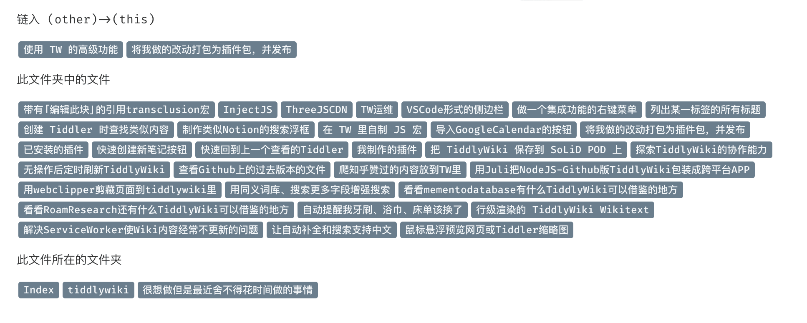
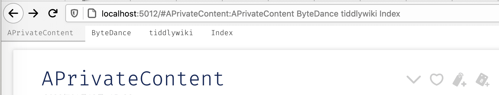
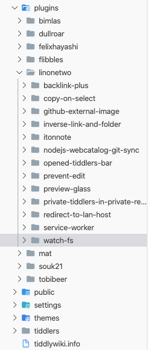

# plugins

Plugins developed for a better [TiddlyGit](https://github.com/tiddly-gittly/TiddlyGit-Desktop).

## About

### Watch-FS

"linonetwo/watch-fs"

This plugin enables TiddlyWiki to watch the change in your disk, solves [pick up changes made by outside agencies #1530](https://github.com/Jermolene/TiddlyWiki5/issues/1530), and if you edit one of your tiddler using editor likes VSCode and save it on the disk, the change will immediately reflected in the browser.

This by default monitor `./tiddlers` folder, if you have a different setup like my [linonetwo/wiki](https://github.com/linonetwo/wiki), add a `watchFolder` config to your `tiddlywiki.info`:

```json
{
  ...
  "themes": [
    "tiddlywiki/vanilla",
    "linonetwo/itonnote"
  ],
  ...
  "config": {
    "watchFolder": "./Meme-of-LinOnetwo/tiddlers"
  },
```

See [Jermolene/TiddlyWiki5/issues/3060](https://github.com/Jermolene/TiddlyWiki5/issues/3060) for related discussions.

Server side only. But also change the `SyncPollingInterval.tid` in the client side.

### Prevent-Edit

"linonetwo/prevent-edit"

Prevent `This page is asking you to confirm that you want to leave - data you have entered may not be saved` to popup.

Client side only.

### Service-Worker

"linonetwo/service-worker"

Needs additional setup, see plugin folder for details, only use it if you are an experienced web developer...

Client side only.

### Copy On Select

"linonetwo/copy-on-select"

When you select a string in your wiki, it will be copied automatically!

Client side only.

### Inverse Link And Folder

"linonetwo/inverse-link-and-folder"

Yet another bidirectional-link plugin.



Client side only.

### Opened Tiddlers Bar

"linonetwo/opened-tiddlers-bar"

A VSCode style "opened tiddler" bar on the top of the wiki.



Client side only.

### SCM

"linonetwo/source-control-management"

Allow you view modified tiddlers in your git-backup-ed nodejs wiki, inside TiddlyGit-Desktop.

Note this plugin uses git api provided by TiddlyGit-Desktop, you can't use it alone.


## How to use

Place the plugin like this:



And update your `tiddlywiki.info`, pick what you need:

```json
{
  "description": ".....",
  "plugins": [
    "linonetwo/service-worker",
    "linonetwo/opened-tiddlers-bar",
    "linonetwo/inverse-link-and-folder",
    "linonetwo/copy-on-select",
    "linonetwo/prevent-edit",
    "linonetwo/watch-fs"
  ],
  "themes": ["tiddlywiki/vanilla", "linonetwo/itonnote"],
  "languages": ["zh-Hans"]
}
```
